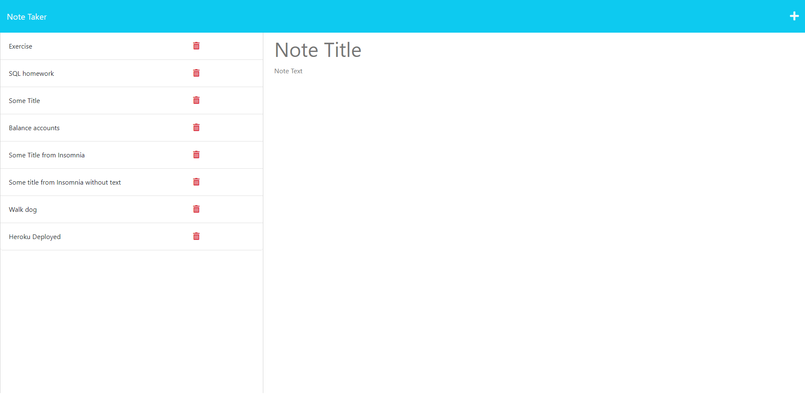

# Express Note Taker  

[](./LICENSE)  

## Description  

This application uses an Express.js back end to handle users' HTTP and API requests. The user can save, retrieve and delete notes on the front-end webpage.  

## Table of Contents  
- [Link](#link)
- [Screenshot](#screenshot)
- [Installation](#installation)
- [Usage](#usage)
- [License](#license)
- [Contribute](#contribute)
- [Tests](#tests)
- [Questions](#questions)  

## Link

Page published at https://agile-tundra-69352-168b646c9d8b.herokuapp.com/

## Screenshot



## Installation  

```bash
npm i  
```

## Usage  

```bash
node server.js
```

## License  

This project is licensed under the [MIT license](LICENSE).  

## Contribute  

N/A  

## Tests  

N/A  

## Questions  

If you have any questions about the repository, open an issue or contact me directly at [m.tan1230@gmail.com](mailto:m.tan1230@gmail.com). You can find more of my work at [Mtan1230](https://github.com/Mtan1230).
